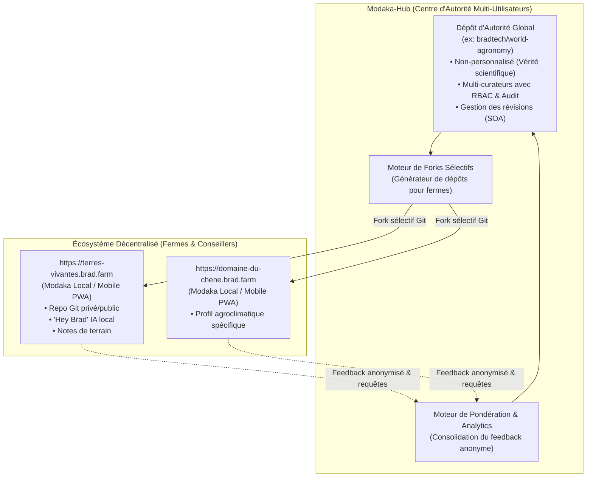

# Architecture & Vision Stratégique : Modaka-Hub

> **Auteur** : Équipe Quatrain & Bradtech  
> **Date** : 24 Août 2026  
> **Statut** : Proposition d'Architecture & Synthèse d'Unification  
> **Version** : 1.0.0  

---

## 1. Schéma d'Architecture Globale

---

## 2. Pourquoi l'Unification "Modaka-Hub" est la Meilleure Approche

Le projet initial (Bookworm / Anemorph) visait à construire un atelier de curation. Or, **Modaka** intègre déjà nativement l'essentiel de ces briques :
- Pipeline d'ingestion et file d'attente asynchrone (SQLite / Queue).
- Moteur de stockage et d'arborescence **OKF v0.1**.
- Moteur d'indexation et de recherche sémantique **QMD**.
- Synchronisation et gestion de versions **Git**.

### La Dualité Écosystème

| Composant | Rôle & Cible | Caractéristiques Clés |
| :--- | :--- | :--- |
| **Modaka-Local (Client / PWA)** | **Ferme individuelle / Agriculteur** (`xyz.brad.farm`) | • **Ultra-personnalisé** au terroir et pratiques locales. • Mono-utilisateur / Équipe de la ferme. • Embarqué sur mobile PWA / PC de bureau. • "Hey Brad" assistant IA & Second Brain personnel. • Dépôt Git privé, semi-public ou ouvert. |
| **Modaka-Hub (Serveur / Organisation)** | **Bradtech / Collectifs d'experts** (`hub.brad.ag`) | • **Non-personnalisé** : Base de vérité agronomique globale & normative. • **Multi-utilisateurs (RBAC)** : Curateurs, experts, relecteurs, administrateurs. • **Source d'Autorité (SOA)** certifiée et numéro de révision. • **Moteur d'Extraction** : Génération de forks sélectifs pour alimenter les fermes. • **Moteur de Pondération** : Réintégration du feedback terrain anonymisé. |

---

## 3. Les 3 Piliers Clés de Modaka-Hub

### A. Gestion Multi-Utilisateurs & Traçabilité (RBAC & Audit Trail)
Dans une organisation comme Bradtech, plusieurs agronomes et experts contribuent simultanément :
1. **Rôles & Permissions** (basés sur `@quatrain/auth`) :
   - `Admin` : Configuration générale, axes taxonomiques, gestion des utilisateurs.
   - `Curator` : Ingestion de documents, qualification sur les axes et édition des fiches.
   - `Reviewer` : Relecture scientifique et validation avant publication.
   - `Extractor` : Droit de générer des packs/forks pour des fermes.
2. **Signature & Lignée OKF** :
   - Chaque modification enregistre l'identité de l'auteur dans le frontmatter YAML et dans les commits Git (`curatedBy: "alice@brad.ag"`, `reviewedBy: "dr.dupont@inrae.fr"`).

### B. Moteur d'Extraction & Forks Sélectifs (`xyz.brad.farm`)
Plutôt qu'un simple export de fichiers, l'extraction pour une ferme génère un **dépôt Git dédié** :
1. **Filtrage Multi-Axial** : Sélection des fiches correspondant au profil de la ferme (ex: sol argilo-calcaire, climat méditerranéen, viticulture bio, rouleau faca).
2. **Initialisation du Repo Client** :
   - Création du dépôt Git (`git@github.com:brad-farms/terres-vivantes.git`).
   - Déploiement automatique de l'instance Modaka client sur `https://terres-vivantes.brad.farm`.
   - Choix de visibilité : **Privé** (secret d'exploitation), **Partiellement Public** (partage avec coopérative ou conseiller), ou **Totalement Public** (open source).
3. **Synchronisation Amont/Aval** :
   - La ferme peut continuer à enrichir son Second Brain localement.
   - Des mises à jour du Hub central peuvent être tirées (`git pull upstream-hub`).

### C. Moteur de Réintégration du Feedback & Pondération Dynamique
1. **Collecte Anonymisée** :
   - Les instances clientes (`*.brad.farm`) envoient périodiquement des statistiques d'usage agrégées (nombre de consultations d'une fiche, votes d'utilité `+1/-1`, mots-clés recherchés sans réponse).
2. **Calcul de Pertinence & Autorité** :
   $$\text{Score} = \text{BaseQuality} \times \log(1 + \text{UsageCount}) \times \left(\frac{\text{HelpfulVotes} + 1}{\text{HelpfulVotes} + \text{UnhelpfulVotes} + 2}\right)$$
3. **Analyse des Lacunes ("Gap Analysis")** :
   - Tableau de bord pour les curateurs de Bradtech identifiant les sujets les plus demandés par les agriculteurs sur le terrain mais encore peu documentés.

---

## 4. Plan de Migration & Action

1. **Rebaptiser le projet** en **`@quatrain/modaka-hub`** (dans `package.json`, composition et interfaces).
2. **Activer la couche d'authentification `@quatrain/auth`** avec login et rôles.
3. **Connecter le moteur d'extraction à la génération de dépôts Git pour `xyz.brad.farm`**.
4. **Finaliser le tableau de bord d'analytics et de pondération des fiches**.
