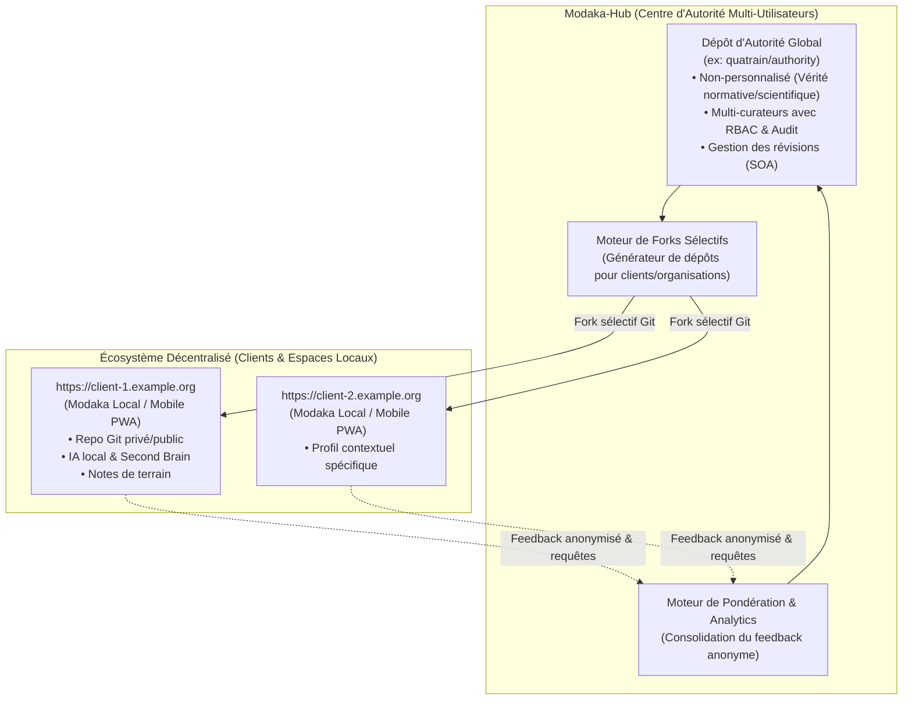

# Architecture & Vision Stratégique : Modaka-Hub

> **Auteur** : Équipe Quatrain
> **Date** : 24 Août 2026  
> **Statut** : Proposition d'Architecture & Synthèse d'Unification  
> **Version** : 1.0.0  

---

## 1. Schéma d'Architecture Globale

---

## 2. Pourquoi l'Unification "Modaka-Hub" est la Meilleure Approche

Le projet initial (Bookworm) visait à construire un atelier de curation. Or, **Modaka** intègre déjà nativement l'essentiel de ces briques :
- Pipeline d'ingestion et file d'attente asynchrone (SQLite / Queue).
- Moteur de stockage et d'arborescence **OKF v0.1**.
- Moteur d'indexation et de recherche sémantique **QMD**.
- Synchronisation et gestion de versions **Git**.

### La Dualité Écosystème

| Composant | Rôle & Cible | Caractéristiques Clés |
| :--- | :--- | :--- |
| **Modaka-Local (Client / PWA)** | **Utilisateur individuel / Organisation locale** (`client.example.org`) | • **Ultra-personnalisé** aux contextes et pratiques locales. • Mono-utilisateur ou équipe restreinte. • Embarqué sur mobile PWA / PC de bureau. • Assistant IA local & Second Brain personnel. • Dépôt Git privé, semi-public ou ouvert. |
| **Modaka-Hub (Serveur / Organisation)** | **Collectifs d'experts / Organisations normatives** (`hub.example.org`) | • **Non-personnalisé** : Base de vérité globale & normative. • **Multi-utilisateurs (RBAC)** : Curateurs, experts, relecteurs, administrateurs. • **Source d'Autorité (SOA)** certifiée et numéro de révision. • **Moteur d'Extraction** : Génération de forks sélectifs pour alimenter les clients. • **Moteur de Pondération** : Réintégration du feedback terrain anonymisé. |

---

## 3. Les 3 Piliers Clés de Modaka-Hub

### A. Gestion Multi-Utilisateurs & Traçabilité (RBAC & Audit Trail)
Dans une organisation centrale, plusieurs experts contribuent simultanément :
1. **Rôles & Permissions** (basés sur `@quatrain/auth-rbac`) :
   - `Admin` : Configuration générale, axes taxonomiques, gestion des utilisateurs.
   - `Curator` : Ingestion de documents, qualification sur les axes et édition des fiches.
   - `Reviewer` : Relecture scientifique et validation avant publication.
   - `Extractor` : Droit de générer des packs/forks pour des clients.
2. **Signature & Lignée OKF** :
   - Chaque modification enregistre l'identité de l'auteur dans le frontmatter YAML et dans les commits Git (`curatedBy: "alice@example.org"`, `reviewedBy: "expert@example.org"`).

### B. Moteur d'Extraction & Forks Sélectifs (`client.example.org`)
Plutôt qu'un simple export de fichiers, l'extraction pour une entité locale génère un **dépôt Git dédié** :
1. **Filtrage Multi-Axial** : Sélection des fiches correspondant au profil cible (axes taxonomiques, pratiques, thématiques).
2. **Initialisation du Repo Client** :
   - Création du dépôt Git (`git@github.com:example-org/client-repo.git`).
   - Déploiement automatique de l'instance Modaka client sur `https://client.example.org`.
   - Choix de visibilité : **Privé** (secret d'exploitation), **Partiellement Public** (partage avec conseillers), ou **Totalement Public** (open source).
3. **Synchronisation Amont/Aval** :
   - L'espace client peut continuer à enrichir son Second Brain localement.
   - Des mises à jour du Hub central peuvent être tirées (`git pull upstream-hub`).

### C. Moteur de Réintégration du Feedback & Pondération Dynamique
1. **Collecte Anonymisée** :
   - Les instances clientes envoient périodiquement des statistiques d'usage agrégées (nombre de consultations d'une fiche, votes d'utilité `+1/-1`, mots-clés recherchés sans réponse).
2. **Calcul de Pertinence & Autorité** :
   $$\text{Score} = \text{BaseQuality} \times \log(1 + \text{UsageCount}) \times \left(\frac{\text{HelpfulVotes} + 1}{\text{HelpfulVotes} + \text{UnhelpfulVotes} + 2}\right)$$
3. **Analyse des Lacunes ("Gap Analysis")** :
   - Tableau de bord pour les curateurs identifiant les sujets les plus demandés par les utilisateurs mais encore peu documentés.

---

## 4. Plan de Migration & Action

1. **Rebaptiser le projet** en **`@quatrain/modaka-hub`** (dans `package.json`, composition et interfaces).
2. **Activer la couche d'authentification `@quatrain/auth`** avec login et rôles.
3. **Connecter le moteur d'extraction à la génération de dépôts Git pour clients**.
4. **Finaliser le tableau de bord d'analytics et de pondération des fiches**.
