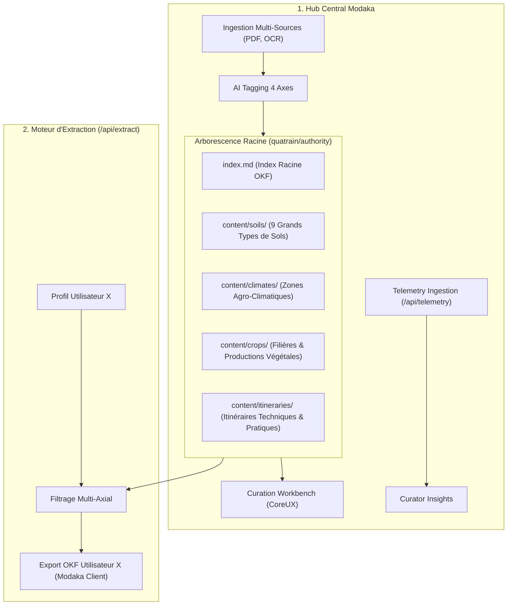

# Modaka-Hub PoC Tracking & Reproduction Workbook

> **Project**: Quatrain Modaka-Hub (Content Curation, Multi-Axial Structuring & Knowledge Delivery Platform)  
> **Status**: Production-Ready PoC Verified & Operational  
> **Date**: August 23, 2026  
> **License**: AGPL-v3  

---

## 1. Executive Summary & Enterprise Architecture

Modaka-Hub is an open-source knowledge curation and structuring platform built on the **Quatrain framework** and the **Open Knowledge Format (OKF v0.1)** standard. It acts as the central **Knowledge Hub**, organizing knowledge into **4 first-class root directories** matching primary taxonomic axes:

---

## 2. The 4 Fundamental Root Axes

| Répertoire Racine | Nom Pédologique | Contenu & Rôle |
| :--- | :--- | :--- |
| **`content/soils/`** | **Sols & Typologies** | Les 9 grands types de sols mondiaux (Calcisols, Luvisols, Vertisols, Arenosols, Cambisols, Andosols, Histosols, Gleysols, Rankers). |
| **`content/climates/`** | **Climats & Agroclimatologie** | Typologies climatiques Köppen adaptées (Méditerranéen, Océanique, Continental, Semi-aride...). |
| **`content/crops/`** | **Productions Végétales** | Filières végétales (Viticulture, Arboriculture, Maraîchage, Grandes Cultures, PPAM, Fourrages). |
| **`content/itineraries/`** | **Itinéraires Techniques** | Pratiques culturales (Semis direct sous couvert, Rouleau Faca, Enherbement permanent, Agroforesterie...). |

---

## 3. Les 9 Grands Types de Sols Curés

| Fiche OKF | Nom & Pédologie | Propriétés Clés & Conduite |
| :--- | :--- | :--- |
| `sol-argilo-calcaire.md` | **Sol Argilo-Calcaire** *(Calcisol / Rendzine)* | Structure grumeleuse stable ($Ca^{2+}$), pH 7.5-8.4, risque de chlorose ferrique, mycorhization et couverts de légumineuses. |
| `sol-limoneux.md` | **Sol Limoneux** *(Luvisol / Sol Brun Lessivé)* | Forte réserve en eau (RU 2mm/cm), très sensible à la battance et au tassement, impératif de couverture à 100% et SDSCV. |
| `sol-sableux.md` | **Sol Sableux** *(Arenosol / Sol Léger)* | Très filtrant et précoce, faible CEC (<8 cmol+/kg), lessivage des nitrates, fractionnement goutte-à-goutte et biochar. |
| `sol-argileux.md` | **Sol Argileux Lourd** *(Vertisol / Pélosol)* | Argiles gonflantes 2:1, CEC >30 cmol+/kg, retrait-gonflement, auto-structuration biologique, enracinement pivotant. |
| `sol-schisteux.md` | **Sol Schisteux** *(Cambisol Dystrique)* | Caillouteux (>60%), drainant, chaud (accumulation thermique nocturne), acide (pH 5.0), murets en terrasses et enherbement partiel. |
| `sol-granitique.md` | **Sol Granitique** *(Arène Granitique / Ranker)* | Sablo-limoneux, acide, riche en silice primaire, pauvre en phosphore assimilable, dépendance vitale aux mycorhizes. |
| `sol-humifere.md` | **Sol Humifère** *(Histosol / Chernozem)* | MO >5-10%, CEC >40 cmol+/kg, fertilité biologique maximale, rétention hydrique x5, zéro travail du sol oxydant. |
| `sol-hydromorphe.md` | **Sol Hydromorphe** *(Gleysol / Planosol)* | Engorgement temporaire/permanent, marbrures d'oxydoréduction, anoxie racinaire, profilage en billons et plantes-pompes. |
| `sol-volcanique.md` | **Sol Volcanique** *(Andosol / Cendres)* | Densité <0.9 g/cm³, porosité >65%, complexes allophane-humus, fixation du phosphore, apport de MO fraîche. |

---

## 4. Repositories & État Git

Tous les projets sont alignés et validés :
- `Quatrain/CoreUX` : `develop`
- `Quatrain/modaka-hub` : `develop`
