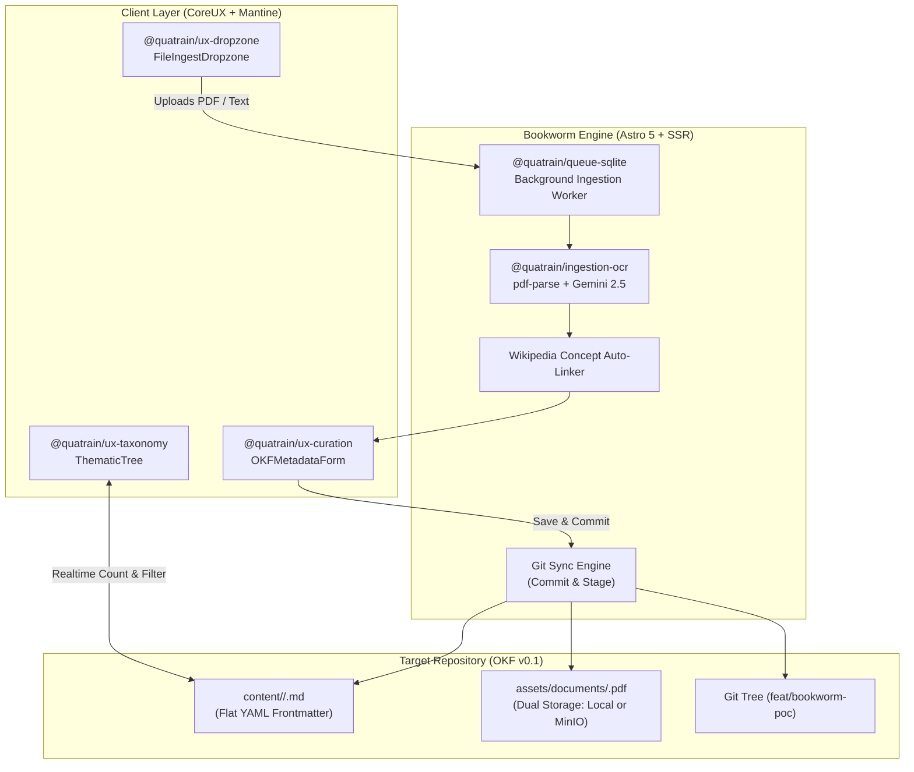

# Bookworm PoC Tracking & Reproduction Workbook

> **Project**: Quatrain Bookworm (Content Curation & OKF Structuring Platform)  
> **Status**: PoC Stage 1 Verified & Operational  
> **Date**: August 23, 2026  
> **License**: AGPL-v3  

---

## 1. Executive Summary & Architecture Overview

Bookworm is an open-source knowledge curation and structuring platform built on top of the **Quatrain framework** and the **Open Knowledge Format (OKF v0.1)** standard. It inherits ingestion, extraction, and background processing mechanics from **Modaka** while providing a dedicated 3-panel Curation Workbench powered by reusable **CoreUX** components.



---

## 2. Repositories & Forking Topology

All projects are strictly aligned on branch `feat/bookworm-poc` with zero modifications to `develop` or `main`:

| Repository | GitHub Location | Local Workspace Path | Branch | Role |
| :--- | :--- | :--- | :--- | :--- |
| **Quatrain Upstream** | `github.com/Quatrain/bookworm` | — | `feat/bookworm-poc` | Upstream canonical repo |
| **Contributor Fork** | `github.com/crapougnax/bookworm` | `/Users/crapougnax/CODE/CRAPOUGNAX/bookworm` | `feat/bookworm-poc` | Main application code & workbench |
| **CoreUX Monorepo** | `github.com/Quatrain/CoreUX` | `/Users/crapougnax/CODE/QUATRAIN/CoreUX` | `feat/bookworm-poc` | Reusable taxonomy, dropzone & curation packages |
| **Target Dataset** | `github.com/bradtech/world-agronomy` | `/Users/crapougnax/CODE/BRAD2026/world-agronomy` | `feat/bookworm-poc` | OKF Agronomic Knowledge Base & assets |

---

## 3. Step-by-Step Reproduction Guide (From Scratch)

### Step 1: Upstream & Fork Initialization

```bash
# 1. Create upstream and personal fork
gh repo create Quatrain/bookworm --public --license AGPL-3.0 --description "Open Knowledge Format (OKF) Curation & Research Platform"
gh repo fork Quatrain/bookworm --clone=false --default-branch-only=false

# 2. Clone fork locally and configure 3-tier remotes
cd /Users/crapougnax/CODE/CRAPOUGNAX
git clone git@github.com:crapougnax/bookworm.git
cd bookworm
git remote add upstream https://github.com/Quatrain/bookworm.git
git checkout -b feat/bookworm-poc
```

### Step 2: Target Repository Creation (`world-agronomy`)

```bash
# 1. Create target content repo
cd /Users/crapougnax/CODE/BRAD2026
gh repo create bradtech/world-agronomy --private --description "Agronomic Knowledge Base (OKF v0.1)"
git clone git@github.com:bradtech/world-agronomy.git
cd world-agronomy
git checkout -b feat/bookworm-poc

# 2. Bootstrap OKF v0.1 directory tree & index
mkdir -p content/soil-health content/cover-crops content/water-management content/agroforestry content/crop-protection assets/documents
```

### Step 3: CoreUX Component Packages (`Quatrain/CoreUX`)

In `/Users/crapougnax/CODE/QUATRAIN/CoreUX`, create the following packages:
1. **`@quatrain/ux-taxonomy`**:
   - `TaxonomyController.ts`: Headless state controller for hierarchical categories, counts, active selection, and expand/collapse states.
   - `TaxonomyController.test.ts`: Co-located unit tests (100% pass rate).
   - `ThematicTree.tsx`: Mantine tree view with search input, counts badge, and thematic icons.
   - `ThematicBadgeGroup.tsx`: Multi-select transversal thematic badges.
2. **`@quatrain/ux-dropzone`**:
   - `FileIngestDropzone.tsx`: Drag & drop container supporting PDF, images, and text with live queue processing status cards.
3. **`@quatrain/ux-curation`**:
   - `OKFMetadataForm.tsx`: Unified metadata editor with dual Visual Form & Raw YAML tab.
   - `CurationCard.tsx`: Document card showing title, excerpt, thematic badges, and action buttons.

Run tests:
```bash
cd /Users/crapougnax/CODE/QUATRAIN/CoreUX
yarn test
```

### Step 4: Bookworm Application Scaffolding

In `/Users/crapougnax/CODE/CRAPOUGNAX/bookworm`:
1. Initialize Astro with React & Mantine:
   ```bash
   yarn init -y
   yarn add astro @astrojs/react @astrojs/node react react-dom @mantine/core @mantine/hooks @mantine/dropzone @tabler/icons-react yaml pdf-parse dotenv
   ```
2. Configure `astro.config.mjs` with portal aliases:
   ```javascript
   import { defineConfig } from 'astro/config';
   import react from '@astrojs/react';
   import node from '@astrojs/node';
   import path from 'node:path';

   export default defineConfig({
     output: 'server',
     adapter: node({ mode: 'standalone' }),
     integrations: [react()],
     vite: {
       ssr: { noExternal: [/@quatrain\/.*/, /@mantine\/.*/] },
       resolve: {
         alias: {
           '@quatrain/core': path.resolve(__dirname, '../QUATRAIN/Core/packages/core/src/index.ts'),
           '@quatrain/backend': path.resolve(__dirname, '../QUATRAIN/Core/packages/backend/src/index.ts'),
           '@quatrain/okf': path.resolve(__dirname, '../QUATRAIN/Core/packages/okf/src/index.ts'),
           '@quatrain/storage': path.resolve(__dirname, '../QUATRAIN/Core/packages/storage/src/index.ts'),
           '@quatrain/storage-local': path.resolve(__dirname, '../QUATRAIN/Core/packages/storage-local/src/index.ts'),
           '@quatrain/queue': path.resolve(__dirname, '../QUATRAIN/Core/packages/queue/src/index.ts'),
           '@quatrain/queue-sqlite': path.resolve(__dirname, '../QUATRAIN/Core/packages/queue-sqlite/src/index.ts'),
           '@quatrain/ux-taxonomy': path.resolve(__dirname, '../QUATRAIN/CoreUX/packages/ux-taxonomy/src/index.ts'),
           '@quatrain/ux-dropzone': path.resolve(__dirname, '../QUATRAIN/CoreUX/packages/ux-dropzone/src/index.ts'),
           '@quatrain/ux-curation': path.resolve(__dirname, '../QUATRAIN/CoreUX/packages/ux-curation/src/index.ts')
         }
       }
     }
   });
   ```

### Step 5: Backend & Ingestion Queue Pipeline

1. **`src/lib/backend.ts`**:
   - Initializes `LocalStorageAdapter` on `/Users/crapougnax/CODE/BRAD2026/world-agronomy/assets`.
   - Initializes `OKFBackendAdapter` with `database: /Users/crapougnax/CODE/BRAD2026/world-agronomy`.
   - Sets up `SQLiteQueueAdapter` at `.bookworm-queue/queue.sqlite`.
2. **`src/lib/queue.ts`**:
   - Background worker listening to channel `'ingestion'`.
   - Parses PDF files using `pdf-parse`.
   - Performs AI entity extraction and categorization via `@quatrain/ai-gemini`.
   - Persists binary assets to `assets/documents/<filename>.pdf`.
   - Saves OKF document to `content/<thematic>/<slug>.md`.
   - Triggers Wikipedia concept auto-linking for proper nouns.
   - Automatically stages and commits new files to Git.

---

## 4. Operational Verification & Testing

### A. Development Server
```bash
cd /Users/crapougnax/CODE/CRAPOUGNAX/bookworm
yarn astro dev --port 4322 --host 127.0.0.1
```
Access the Workbench at: **`http://127.0.0.1:4322`**

### B. API Verification Commands

#### 1. Query Thematics & Taxonomy
```bash
curl -s http://127.0.0.1:4322/api/taxonomies | jq .
```

#### 2. Upload Research PDF to Queue
```bash
curl -s -X POST http://127.0.0.1:4322/api/upload \
  -F "files=@/path/to/paper.pdf" \
  -F "category=soil-health" \
  -F "thematics=[\"soil-health\", \"cover-crops\"]" \
  -F "source=INRAE Research" | jq .
```

#### 3. Monitor Background Processing Queue
```bash
curl -s http://127.0.0.1:4322/api/queue/status | jq .
```

#### 4. Save Curated Document
```bash
curl -s -X POST http://127.0.0.1:4322/api/curate \
  -H "Content-Type: application/json" \
  -d '{
    "id": "soil-biology-guide",
    "title": "Soil Microbiology in Regenerative Systems",
    "type": "guide",
    "category": "soil-health",
    "thematics": ["soil-health"],
    "tags": ["microbiology", "mycorrhizae", "carbon-sequestration"],
    "description": "Comprehensive guide on mycorrhizal fungi and glomalin production.",
    "body": "# Soil Microbiology\n\nGlomalin plays a vital role in soil aggregate stability."
  }' | jq .
```

#### 5. Verify Git Sync Status & Commit
```bash
curl -s http://127.0.0.1:4322/api/git/status | jq .
curl -s -X POST http://127.0.0.1:4322/api/git/commit \
  -H "Content-Type: application/json" \
  -d '{"message": "feat(curation): update soil biology guide"}' | jq .
```

---

## 5. Storage Evolution (PoC -> Production)

| Feature | Stage 1 (PoC - Current) | Stage 2 (Production Evolution) |
| :--- | :--- | :--- |
| **PDF Binary Storage** | `world-agronomy/assets/documents/*.pdf` | MinIO Object Storage (`https://s3.dev.brad.team/world-agronomy`) via `@quatrain/storage-s3` |
| **OKF Text & Metadata** | Git Local Repo (`world-agronomy/content/`) | Dual Sync: Git Local + Push to GitHub Private Repository |
| **Search Engine** | OKF Frontmatter & Directory Indexing | QMD Vector Search (`@quatrain/searchengine-qmd`) |
| **OCR Processing** | `pdf-parse` text extraction + Gemini 2.5 | Tesseract OCR + Vision LLM for scanned PDFs |
