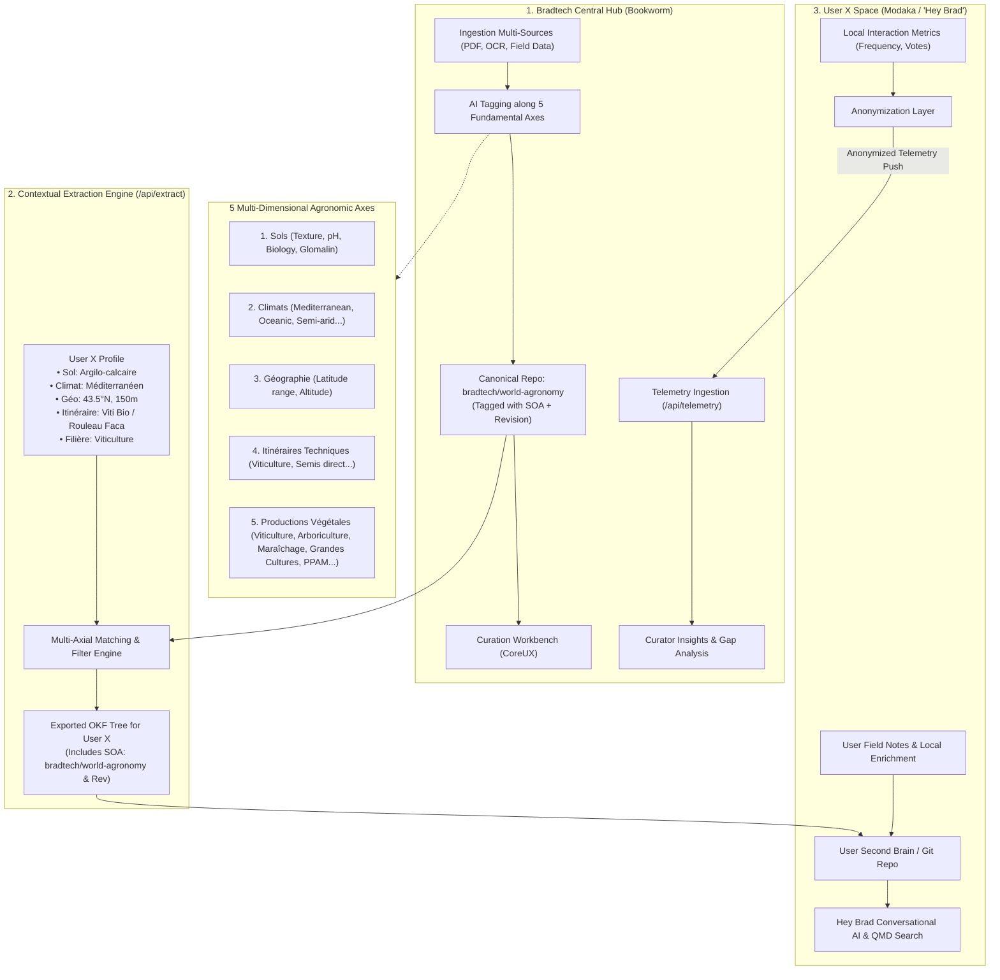

# Bookworm PoC Tracking & Reproduction Workbook

> **Project**: Quatrain Bookworm (Content Curation, Multi-Axial Structuring & Hey Brad Delivery Platform)  
> **Status**: Production-Ready PoC Verified & Operational  
> **Date**: August 23, 2026  
> **License**: AGPL-v3  

---

## 1. Executive Summary & Enterprise Architecture

Bookworm is an open-source knowledge curation and structuring platform built on the **Quatrain framework** and the **Open Knowledge Format (OKF v0.1)** standard. It acts as the central **Knowledge Hub** for organizations (such as Bradtech), allowing experts to ingest raw documents, tag them along **5 multi-dimensional agronomic axes**, extract tailored knowledge packs for specific farmer profiles (delivered to **Modaka / "Hey Brad"**), and collect anonymized feedback loops.



---

## 2. The 5 Multi-Dimensional Agronomic Axes

Every agronomic document in Bookworm is classified across **5 orthogonal axes**:

| Axe | Propriété OKF | Description & Exemples |
| :--- | :--- | :--- |
| **1. Sols** | `soils` (`string[]`) | Texture, biologie et physico-chimie du sol : `argilo-calcaire`, `limoneux`, `sableux`, `granitique`, `schisteux`, `acide`, `alcalin`, `hydromorphe`, `vivant-microbiote`, `glomaline`. |
| **2. Climats** | `climates` (`string[]`) | Zones agro-climatiques (classification Köppen adaptée) : `mediterraneen`, `oceanique`, `continental`, `semi-aride`, `subtropical`, `montagnard`, `aridite-estivale`. |
| **3. Latitude & Altitude** | `geo` / `latitudes` / `altitudes` | Zonage géographique et altimétrique : `latitudes: ["40-45N"]`, `altitudes: ["colline-200-500m"]`, ou `latitudeRange: [42.0, 45.5]`. |
| **4. Itinéraires Techniques** | `itineraries` (`string[]`) | Pratiques culturales et systèmes de production : `viticulture-biologique`, `arboriculture-fruitiere`, `maraichage-sol-vivant`, `grandes-cultures-semis-direct`, `enherbement-permanent`, `agroforesterie-intra-parcellaire`, `irrigation-goutte-a-goutte`, `taille-guyot-poussard`, `faca-roulage`. |
| **5. Productions Végétales** | `crops` (`string[]`) | Filières et types de cultures : `viticulture` (vigne), `arboriculture` (olivier, pommier, amandier...), `maraichage` (légumes, petits fruits), `grandes-cultures` (céréales, oléagineux, protéagineux), `ppam` (plantes à parfum, aromatiques et médicinales), `fourrages` (prairies permanentes, luzerne). |

---

## 3. Provenance & Lineage Contract (Mandatory SOA & Revision)

All fiches generated, curated, or exported through Bookworm MUST include:
1. **`soa` (Source of Authority)** : `bradtech/world-agronomy` (or upstream repository identifier).
2. **`revision`** : Monotonic semver or Git commit SHA (e.g. `rev-1.2.0` or `rev-094fa44`).

Example generated OKF frontmatter:
```yaml
---
soa: bradtech/world-agronomy
revision: rev-1.2.0
type: guide
title: Gestion du Sol Vivant, Glomaline et Mycorhizes en Viticulture Méditerranéenne
category: soil-health
thematics:
  - soil-health
soils:
  - argilo-calcaire
  - vivant-microbiote
  - glomaline
climates:
  - mediterraneen
  - semi-aride
latitudes:
  - 40-45N
altitudes:
  - colline-200-500m
  - plaine-0-200m
itineraries:
  - viticulture-biologique
  - enherbement-permanent
  - rouleau-faca
crops:
  - viticulture
source: INRAE & Bradtech Research
documentDate: 2026-06-10
extractedFor: vigneron-domaine-des-terres-vivantes
extractedAt: 2026-08-23T17:22:08.970Z
---
```

---

## 4. Contextual Extraction Engine (`/api/extract`)

The Contextual Extraction Engine creates tailored OKF bundles for specific farmers/users based on the 5 axes:

```bash
curl -s -X POST http://127.0.0.1:4322/api/extract \
  -H "Content-Type: application/json" \
  -d '{
    "userId": "vigneron-domaine-des-terres-vivantes",
    "userName": "Domaine des Terres Vivantes (Hérault)",
    "soils": ["argilo-calcaire", "glomaline"],
    "climates": ["mediterraneen"],
    "latitude": 43.6,
    "altitude": 140,
    "itineraries": ["viticulture-biologique", "rouleau-faca"],
    "crops": ["viticulture"],
    "destinationPath": "/Users/crapougnax/CODE/CRAPOUGNAX/second-brain-data"
  }'
```

---

## 5. Anonymized Telemetry Loop (`/api/telemetry`)

Hey Brad sends anonymized usage telemetry back to Bookworm:
```bash
curl -s -X POST http://127.0.0.1:4322/api/telemetry \
  -H "Content-Type: application/json" \
  -d '{
    "clientVersion": "hey-brad-v1.0.0",
    "telemetryBatch": [
      {
        "documentUid": "gestion-sol-vivant-glomaline-viticulture",
        "soa": "bradtech/world-agronomy",
        "revision": "rev-1.2.0",
        "usageCount": 18,
        "helpfulVotes": 5,
        "unhelpfulVotes": 0,
        "contextKeywords": ["glomaline", "rouleau faca", "mycorhizes", "sécheresse"]
      }
    ]
  }'
```

---

## 6. Repositories & Forking Topology

All projects are aligned on branch `feat/bookworm-poc` with zero modifications to `develop` or `main`:

| Repository | GitHub Location | Local Workspace Path | Branch | Role |
| :--- | :--- | :--- | :--- | :--- |
| **Quatrain Upstream** | `github.com/Quatrain/bookworm` | — | `feat/bookworm-poc` | Upstream canonical repo |
| **Contributor Fork** | `github.com/crapougnax/bookworm` | `/Users/crapougnax/CODE/CRAPOUGNAX/bookworm` | `feat/bookworm-poc` | Main application code & workbench |
| **CoreUX Monorepo** | `github.com/Quatrain/CoreUX` | `/Users/crapougnax/CODE/QUATRAIN/CoreUX` | `feat/bookworm-poc` | Reusable taxonomy, dropzone & curation packages |
| **Target Dataset** | `github.com/bradtech/world-agronomy` | `/Users/crapougnax/CODE/BRAD2026/world-agronomy` | `feat/bookworm-poc` | Canonical OKF Agronomic Knowledge Base |
