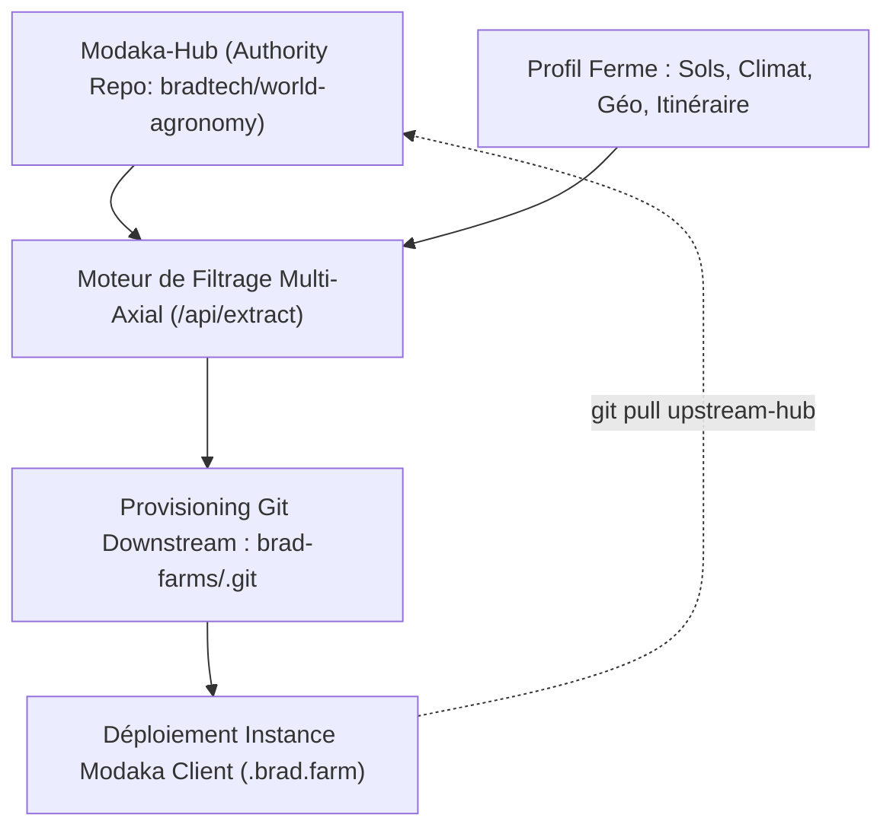

# Ticket #1 : Moteur de Forks Sélectifs & Provisioning de Dépôts Git pour Fermes (`xyz.brad.farm`)

- **ID :** TICKET-01
- **Statut :** 📋 Backlog / Spécifié
- **Priorité :** Haute
- **Composants :** `modaka-hub`, `@quatrain/backend`, `@quatrain/git`
- **Auteurs :** Équipe Quatrain & Bradtech

---

## 🎯 Objectif Métier

Permettre à un conseiller ou agronome Bradtech de générer en un clic un **dépôt Git dédié et sur-mesure** pour une ferme abonnée (`https://<ferme>.brad.farm`), contenant exclusivement les fiches agronomiques et itinéraires techniques pertinents pour son terroir et son profil cultural.

---

## 🏗️ Architecture & Spécifications Techniques



### 1. Ingestion du Profil Agro-Climatique de la Ferme
L'endpoint `POST /api/extract` reçoit :
- `farmId` : Identifiant unique de la ferme (ex: `terres-vivantes`)
- `domain` : Sous-domaine ciblé (ex: `terres-vivantes.brad.farm`)
- `axesProfile` :
  - `soils` : ex. `["argilo-calcaire", "vivant-microbiote"]`
  - `climates` : ex. `["mediterraneen"]`
  - `latitudes` / `altitudes`
  - `itineraries` : ex. `["viticulture-biologique", "faca-roulage"]`
- `visibility` : `private` | `unlisted` | `public`

### 2. Initialisation & Arborescence Git
- Création du dépôt cible (via API GitHub / Forge d'hébergement Git Bradtech).
- Copie des fiches OKF correspondantes avec conservation des métadonnées `soa: bradtech/world-agronomy` et du SHA de révision.
- Génération d'un `index.md` racine contextualisé.
- Configuration du remote upstream :
  ```bash
  git remote add upstream-hub git@github.com:bradtech/world-agronomy.git
  ```

### 3. Critères d'Acceptation
- [ ] L'extraction génère un dépôt Git valide et propre.
- [ ] Les commits amont de `world-agronomy` peuvent être rebasés ou fusionnés par l'agriculteur (`git pull upstream-hub main`).
- [ ] Les notes de terrain ajoutées localement par l'agriculteur ne sont pas écrasées lors des synchronisations amont.
