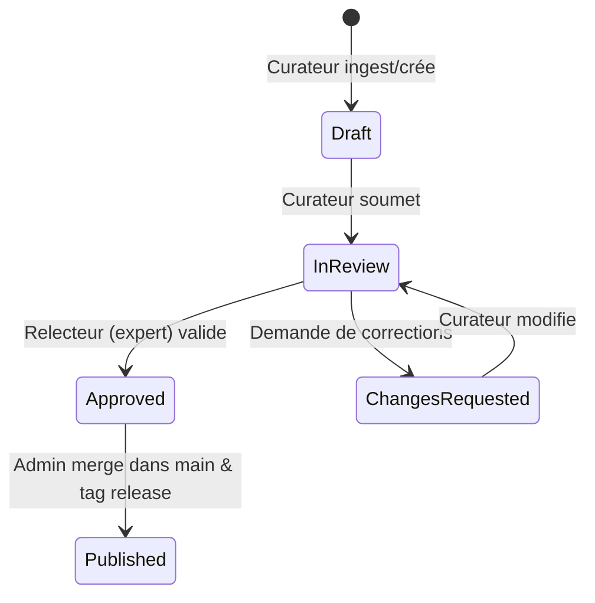

# Ticket #4 : Traçabilité & Signatures Multi-Curateurs (Audit Trail & Peer Review)

- **ID :** TICKET-04
- **Statut :** 📋 Backlog / Spécifié
- **Priorité :** Basse / Enterprise
- **Composants :** `modaka-hub`, `@quatrain/auth-rbac`, Git
- **Auteurs :** Équipe Quatrain & Bradtech

---

## 🎯 Objectif Métier

Garantir la rigueur scientifique de `world-agronomy` en instaurant un processus de **relecture par les pairs (Peer Review)** avant publication officielle d'une fiche, avec signature cryptographique ou attribution claire des curateurs et relecteurs.

---

## 🏗️ Spécifications Techniques

### 1. Cycle de Vie d'une Fiche OKF


### 2. Métadonnées Frontmatter Étendues
```yaml
---
soa: bradtech/world-agronomy
revision: rev-2026.09-8af31e
status: approved # draft | in-review | approved | published
curatedBy: "alice.martin@brad.ag"
reviewedBy: "dr.dupont@inrae.fr"
reviewedAt: "2026-09-03T18:00:00Z"
reviewNotes: "Recommandations validées d'après les essais 2024-2025."
---
```

### 3. Rôle RBAC `reviewer`
- Ajout du rôle `reviewer` dans `src/rbac/roles.ts`.
- Droit d'approuver ou rejeter les fiches, sans droit de commit/push direct sur `main`.

### 4. Critères d'Acceptation
- [ ] Statut de publication affiché sur la `CurationCard`.
- [ ] Les fiches en statut `draft` ne sont pas exportées lors des extractions pour les fermes.
- [ ] Historique de relecture consultable dans le Workbench.
