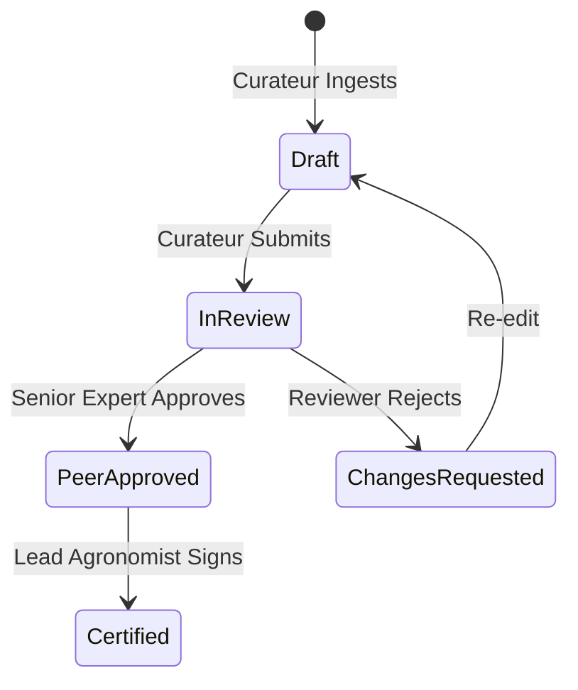

# Ticket #4: Multi-Curator Peer Review Lifecycle, Audit Trail & Cryptographic Signatures

- **ID:** TICKET-04
- **Status:** 📋 Backlog / Specified
- **Priority:** Low
- **Components:** RBAC Engine, OKF Frontmatter Schema, Git Commit Signing
- **Authors:** Quatrain Engineering Team

---

## 🎯 Objective & Business Value

Establish an enterprise-grade scientific validation lifecycle for critical agricultural knowledge:
- Enforce a formal multi-curator review flow (`draft` $\to$ `in_review` $\to$ `peer_approved` $\to$ `certified`).
- Provide an unforgeable, immutable audit trail tracking who reviewed, approved, or edited each technical claim.
- Cryptographically sign published knowledge assets using ed25519 commit signatures or GPG.

---

## 🏗️ Technical Architecture & Specifications

### 1. Document Lifecycle States & RBAC Transitions


- Standard curators can only transition from `draft` to `in_review`.
- Only users with `reviewer` or `admin` roles can approve or certify documents.

### 2. OKF Frontmatter Signatures
```yaml
---
id: biocontrol-mildew-copper-reduction
type: technical-itinerary
curator_trail:
  - user_id: 2ec2520e-7a0d-4fb0-884a-22f41a373567
    email: curator@example.org
    role: curator
    action: drafted
    timestamp: 2026-09-03T18:45:00Z
  - user_id: a84c9102-19bc-43fd-88fa-33c901e82811
    email: expert@inrae.fr
    role: senior-reviewer
    action: approved
    timestamp: 2026-09-04T09:12:00Z
    signature_hash: ed25519:7a4f91...
---
```

---

## 📋 Acceptance Criteria

- [ ] Transition state guards enforced by `@quatrain/auth-rbac`.
- [ ] Audit trail appended to OKF YAML frontmatter without breaking standard parsers.
- [ ] Historical changelog visible in the workbench revision panel.
